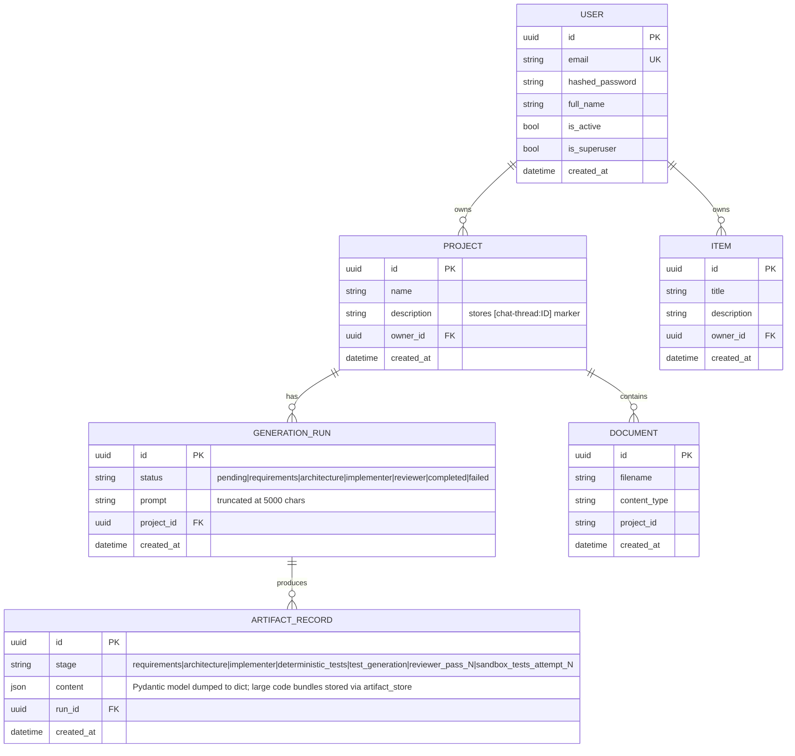
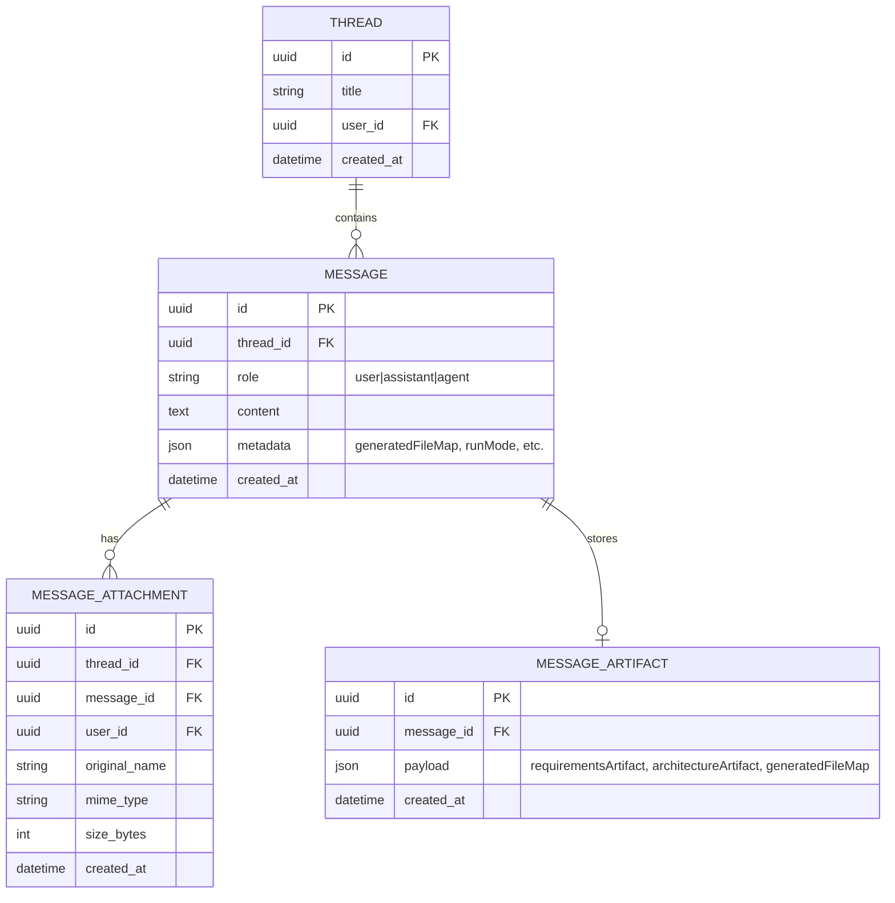

# CraftLive — Database Schema

## Backend Database (PostgreSQL via SQLModel)



## Frontend Database (Supabase)



## Thread ↔ Project Mapping

The frontend uses Supabase threads; the backend uses PostgreSQL projects. They are linked via:

```
Project.description = "[chat-thread:{supabase_thread_id}]"
```

This marker is set by `_resolve_or_create_project_for_thread()` in `generate.py` and queried by:
- `generate.py` — to reuse the same project across multiple runs in one thread
- `sandbox.py` — to locate the project when deploying by thread ID

## Artifact Storage

Large generated code bundles are stored on disk via `artifact_store.py` rather than being inlined into the database JSON. The `ArtifactRecord.content` field contains a `bundle_ref` path pointing to the file on disk in `backend/artifact_store/`.

## Transaction Safety

All CRUD operations (`create_user`, `create_project`, `create_generation_run`, `create_artifact_record`) are wrapped in:

```python
try:
    session.add(obj)
    session.commit()
    session.refresh(obj)
except Exception:
    session.rollback()
    raise
```
