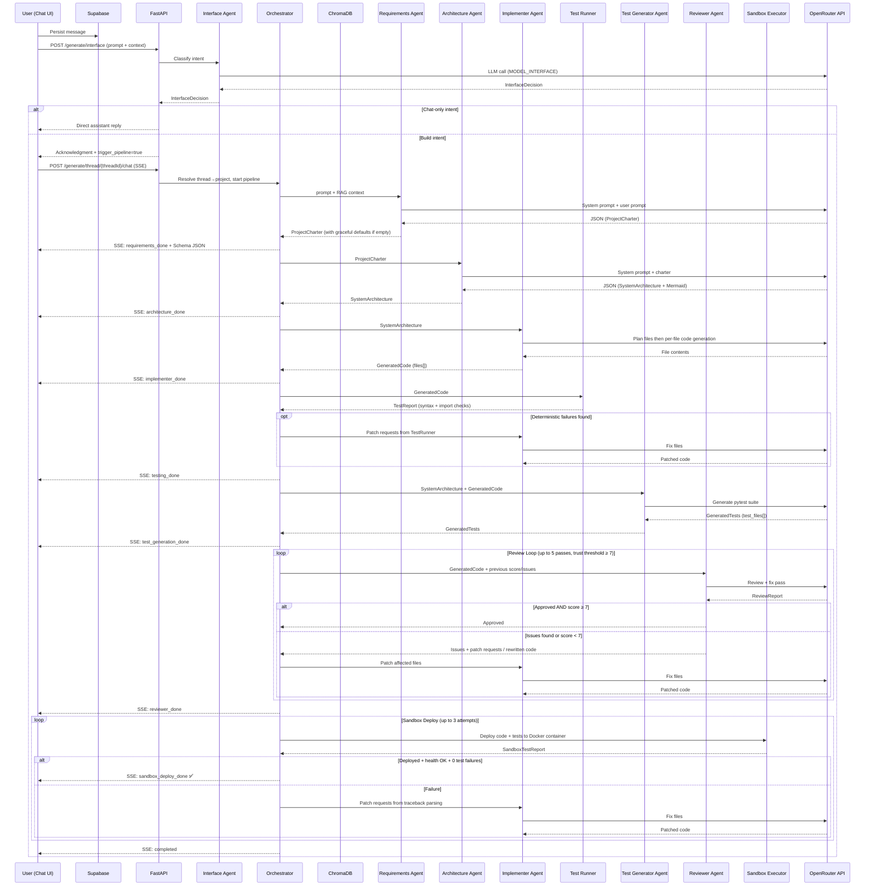

# CraftLive — Agent Pipeline Flow

## Artifact Types

| Stage | Pydantic Model | Key Fields |
|-------|---------------|------------|
| Requirements | `ProjectCharter` | project_name, entities, endpoints, business_rules, auth_required |
| Architecture | `SystemArchitecture` | design_document, mermaid_diagram, components, data_model_summary, endpoint_summary |
| Implementer | `GeneratedCode` | files (path + content), dependencies |
| Deterministic Tests | `TestReport` | passed, checks_run, failures, patch_requests |
| Test Generation | `GeneratedTests` | test_files (path + content), dependencies |
| Reviewer | `ReviewReport` | issues, suggestions, security_score, approved, final_code, patch_requests |
| Sandbox | `SandboxTestReport` | deployed, health_check_ok, tests_passed, tests_failed, tests_total, failures, test_output |

## SSE Event Stream

| Event | Stage | Payload |
|-------|-------|---------|
| `starting` | Init | message |
| `requirements` | Requirements | message |
| `requirements_done` | Requirements | artifact JSON |
| `architecture` | Architecture | message |
| `architecture_done` | Architecture | artifact JSON |
| `implementer` | Implementer | message |
| `implementer_done` | Implementer | files_count, artifact JSON |
| `testing` | Deterministic Tests | message |
| `testing_fix` | Deterministic Tests | failures, message |
| `testing_done` | Deterministic Tests | passed, checks |
| `test_generation` | Test Generation | message |
| `test_generation_done` | Test Generation | test_files |
| `reviewer` | Reviewer | attempt, prev_score, message |
| `revision` | Reviewer | attempt, score, issues_count |
| `reviewer_done` | Reviewer | score, artifact |
| `sandbox_deploy` | Sandbox | attempt, message |
| `sandbox_retry` | Sandbox | attempt, errors |
| `sandbox_deploy_done` | Sandbox | artifact (SandboxTestReport) |
| `completed` | Final | summary, all captured artifacts |
| `error` | Any | error message |
