# CraftLive — RAG Pipeline

The RAG system is used **exclusively for generated code indexing and retrieval**. Document-upload RAG context injection into the agent pipeline is currently disabled.

## Active: Generated Code RAG

```mermaid
graph LR
    Pipeline["🔄 Pipeline Completes<br/>(Generated Code Files)"]
    Index["Code Chunking<br/>& Embedding"]
    Store[("ChromaDB<br/>(Per-Thread Collection)")]
    Question["User Asks About<br/>Generated Code"]
    Retrieve["Similarity Search<br/>(top-5 snippets)"]
    Answer["🧠 Interface Agent<br/>Grounded Q&A"]

    Pipeline -->|"replace_thread_generated_files()"| Index --> Store
    Question --> Retrieve --> Store
    Store --> Retrieve -->|"Relevant code snippets"| Answer

    style Store fill:#E91E63,color:#fff
    style Pipeline fill:#FF9800,color:#fff
    style Answer fill:#4CAF50,color:#fff
```



### How it works

1. After a pipeline run completes, `generate.py` indexes **all generated code files** into ChromaDB keyed by `thread_id`
2. When a user asks a follow-up question (e.g., *"how does auth work?"*), the Interface Agent detects it as a code question
3. `query_thread_generated_files()` retrieves the top-5 most similar code snippets
4. The Interface Agent answers using only the retrieved snippets, citing specific files and lines

### Configuration

| Parameter | Value |
|-----------|-------|
| Embedding model | `models/text-embedding-004` (Gemini) |
| Vector store | ChromaDB with persistent storage (`backend/chroma_db/`) |
| Retrieval | Top-5 most similar chunks |
| Scope | Per-thread (each thread has its own generated code collection) |
| Indexing trigger | Automatic after pipeline completion |

## Disabled: Document Upload RAG

The document upload → RAG context injection path exists in `orchestrator.py` but is **commented out**:

```python
# 1. RAG Context (Temporarily disabled for model testing)
# rag_context = get_rag_manager().query_context(str(project_id), prompt)
```

When re-enabled, this would allow uploaded PDFs/text files to be chunked, embedded, and injected as context into the requirements agent prompt. Currently, uploaded document context is handled via the frontend's `thread_context_files` payload instead (session-local, not persisted via RAG).
