# CraftLive — System Architecture

```mermaid
graph TB
    subgraph Frontend ["Frontend (React + Vite)"]
        Chat["💬 Chat Panel"]
        Upload["📄 Document Upload"]
        Pipeline["🔄 Pipeline Status (SSE)"]
        ArtView["📋 Artifact Viewer"]
        CodeView["💻 Code Preview + ZIP Download"]
        Schema["🗂️ Schema Visualizer (ER Diagrams)"]
        MockTester["🧪 Dynamic API Tester"]
        Sandbox["🚀 Live Sandbox + Swagger"]
    end

    subgraph Backend ["Backend (FastAPI)"]
        API["REST API + SSE Streaming"]
        Interface["🧠 Interface Agent (Intent Router)"]
        Orch["🎯 Orchestrator"]
        SandboxExec["🐳 Sandbox Executor"]

        subgraph RAG ["Generated Code RAG"]
            CodeIdx["Code Indexing<br/>(post-pipeline)"]
            Embed["Embedding (Gemini)"]
            VDB[("ChromaDB<br/>(Per-Thread Store)")]
        end

        subgraph Agents ["Agent Pipeline"]
            direction LR
            A1["🗂️ Requirements<br/>Agent"]
            A2["🏗️ Architecture<br/>Agent"]
            A3["💻 Implementer<br/>Agent"]
            TR["🧪 Test Runner<br/>(Deterministic)"]
            TG["📝 Test Generator<br/>Agent"]
            A4["🔍 Reviewer<br/>Agent"]
        end
    end

    subgraph External ["External Services"]
        LLM["OpenRouter API<br/>(Qwen, DeepSeek, Gemini, etc.)"]
        PG[("PostgreSQL")]
        Supa[("Supabase<br/>(threads / messages)")]
        Sentry["Sentry<br/>(Error Tracking)"]
    end

    Chat -->|"User prompt"| API
    API --> Interface
    Interface -->|"Build intent"| Orch
    Interface -->|"Chat reply"| Chat
    Interface -->|"Code Q&A"| VDB
    Orch --> A1 --> A2 --> A3 --> TR --> TG --> A4
    A4 -.->|"Fix & Re-review<br/>(up to 5 passes)"| A3
    Orch -->|"Auto-deploy & test"| SandboxExec
    SandboxExec -.->|"Failure → patch & retry<br/>(up to 3 attempts)"| A3
    Orch -->|"Completed code files"| CodeIdx --> Embed --> VDB
    Interface & A1 & A2 & A3 & A4 & TG -->|"LLM calls"| LLM
    Orch -->|"SSE events"| Pipeline
    Orch -->|"Artifacts"| PG
    A2 -->|"Schema JSON"| Schema
    SandboxExec -->|"Swagger UI"| Sandbox
    ArtView -->|"Fetch artifacts"| API
    CodeView -->|"Download ZIP"| API
    Chat <-->|"Persistence"| Supa

    style Interface fill:#FF5722,color:#fff
    style A1 fill:#4CAF50,color:#fff
    style A2 fill:#2196F3,color:#fff
    style A3 fill:#FF9800,color:#fff
    style TR fill:#795548,color:#fff
    style TG fill:#607D8B,color:#fff
    style A4 fill:#9C27B0,color:#fff
    style VDB fill:#E91E63,color:#fff
    style SandboxExec fill:#00BCD4,color:#fff
```

## Key Architectural Decisions

| Decision | Detail |
|----------|--------|
| **LLM Provider** | Multi-provider via OpenAI-compatible API (OpenRouter). Configurable per-agent: `MODEL_DEFAULT`, `MODEL_IMPLEMENTER`, `MODEL_REVIEWER`, `MODEL_INTERFACE`. Defaults defined in `config.py`. |
| **Interface Routing** | Dedicated `InterfaceAgent` classifies user intent (build, chat, retrieve, code Q&A) before pipeline execution |
| **Thread ↔ Project** | Frontend threads (Supabase) are mapped to backend Projects via `[chat-thread:{id}]` marker in `Project.description` |
| **RAG Usage** | Generated code files are indexed into ChromaDB per-thread for code Q&A. Document-upload RAG context injection is disabled. |
| **Deterministic Testing** | `TestRunner` runs syntax checks and import smoke tests before the review loop. Auto-patches failures via the Implementer. |
| **LLM Test Generation** | `TestGeneratorAgent` generates a `pytest` suite from the architecture and generated code. Tests are deployed alongside code in the sandbox. |
| **Review Loop** | Up to 5 reviewer passes. Code is approved when `review.approved == True` AND `security_score >= 7` (trust threshold). |
| **Sandbox Execution** | `SandboxExecutor` deploys code to a Docker `sandbox-runner` container. `start.sh` runs `uvicorn` then `pytest` natively. Results read via `pytest.log`. Up to 3 deploy+test retries with auto-patching from tracebacks. |
| **Dynamic API Tester** | Frontend `ChatPage.jsx` parses endpoints from the generated `ProjectCharter` artifact and renders them dynamically in the API Tester panel. |
| **Transaction Safety** | All CRUD commits wrapped in try/except with `session.rollback()` |
| **Error Tracking** | Sentry SDK integrated for production error monitoring |
| **Timeout/Retry** | LLM client uses configurable timeout with max retries for large generation calls |
