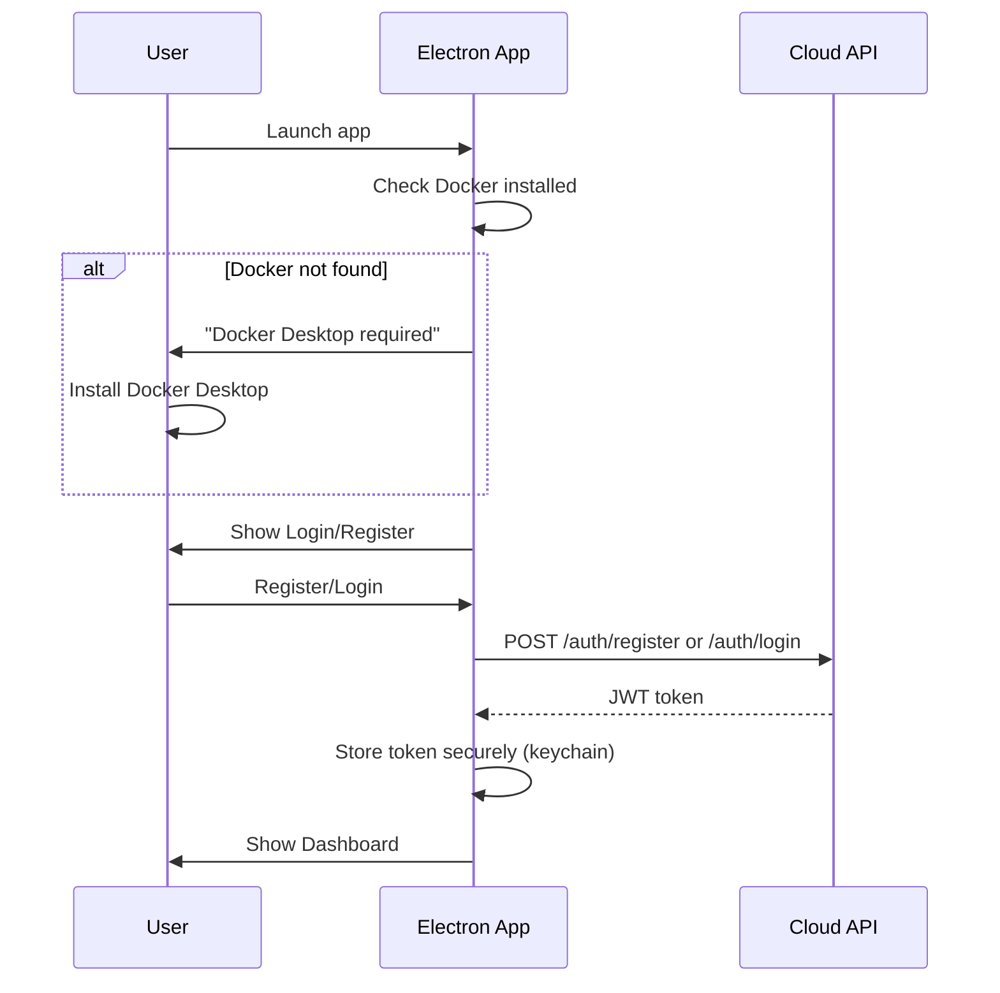
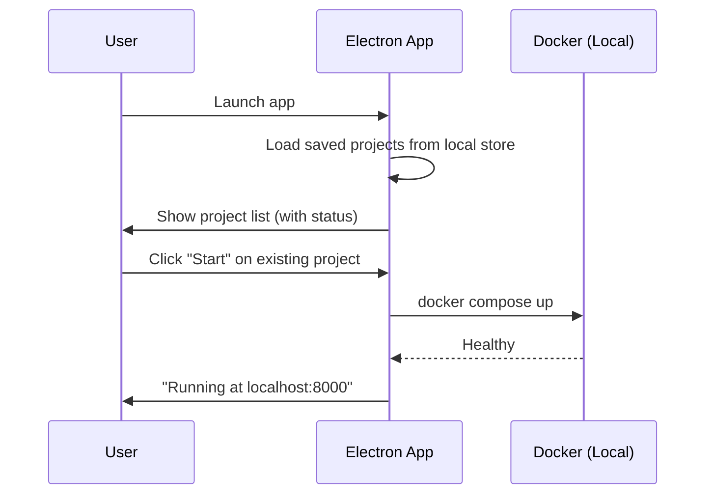

# Cloud + Electron Split Architecture

> **Status**: Proposed · **Last Updated**: 2026-02-21 · **Stack**: Cloud (FastAPI + PostgreSQL) + Desktop (Electron + Docker)

## 1. Overview

The Backend Generation Platform splits into two components:

- **Cloud API** — Handles AI-powered generation (LLM calls, spec review, code generation). Manages user accounts, project history, and billing.
- **Electron Desktop App** — Runs on the user's machine. Deploys generated backends in Docker, verifies them locally, and reports results back to the cloud for auto-fixing.

```mermaid
graph TB
    subgraph Cloud["☁️ Cloud API (FastAPI)"]
        Auth[Auth + User Management]
        P2S[PromptToSpec Agent<br/>LLM + API Keys]
        SR[SpecReview Agent]
        CG[Code Generator]
        PA[Project Assembler]
        FIX[Auto-Fix Agent<br/>LLM + Error Context]
        DB[(PostgreSQL)]
    end

    subgraph Electron["💻 Electron Desktop App"]
        UI[Local UI]
        DM[Docker Manager]
        VR[Verification Runner]
        LB[Live Backend<br/>localhost:8000]
    end

    User((User)) --> UI
    UI -->|JWT + Prompt| Auth
    Auth --> P2S --> SR --> CG --> PA
    PA -->|ZIP artifact| UI
    UI --> DM -->|docker compose up| LB
    LB --> VR
    VR -->|Test results| UI
    UI -->|Failure report| FIX
    FIX -->|Fixed ZIP| UI
```



## 2. Why This Split

| Concern | Cloud-Only (Current) | Cloud + Electron (Proposed) |
|---------|---------------------|---------------------------|
| **Verification compute** | We pay (Docker per generation) | User's machine (free for us) |
| **Docker-in-Docker** | Complex, fragile | Native Docker — reliable |
| **Scaling** | More users = more Docker containers | More users = no extra server load |
| **API keys** | Server-side only | Server-side only (unchanged) |
| **User experience** | Download ZIP, run manually | One-click deploy + live preview |
| **Auto-fix loop** | Server must run Docker | Cloud fixes code, client re-tests |
| **Offline capability** | None | Backend runs locally after generation |

## 3. Component Detail

### 3.1 Cloud API (What Stays)

The cloud API retains all intelligence and secrets.

```
cloud-api/
├── app/
│   ├── main.py                 # FastAPI endpoints
│   ├── platform_db.py          # User accounts + project records
│   ├── platform_auth.py        # JWT auth
│   ├── spec_schema.py          # BackendSpec IR
│   ├── code_generator.py       # Jinja2 templates → code
│   ├── project_assembler.py    # Code → ZIP
│   ├── report_generator.py     # PROJECT_REPORT.md
│   └── storage.py              # User-scoped ZIP storage
├── agents/
│   ├── prompt_to_spec.py       # LLM: prompt → spec
│   ├── spec_review.py          # Validate spec logic
│   ├── model_registry.py       # LLM model config
│   └── auto_fix.py             # NEW: LLM-powered error fixer
├── docker-compose.yml          # Cloud infra (API + PostgreSQL)
└── Dockerfile
```

#### Cloud API Endpoints

**Public:**
| Method | Path | Purpose |
|--------|------|---------|
| `GET` | `/health` | Health check |
| `POST` | `/auth/register` | Create account |
| `POST` | `/auth/login` | Get JWT |
| `GET` | `/models` | Available LLMs |

**Protected (JWT):**
| Method | Path | Purpose |
|--------|------|---------|
| `POST` | `/generate-from-prompt` | Generate ZIP artifact |
| `POST` | `/generate` | Generate from spec JSON |
| `GET` | `/projects` | List user's projects |
| `GET` | `/projects/{id}` | Project detail + artifacts |
| `GET` | `/projects/{id}/download` | Download ZIP |
| `DELETE` | `/projects/{id}` | Delete project |
| `POST` | `/projects/{id}/verify-report` | **NEW** — Receive verification results from Electron |
| `POST` | `/projects/{id}/fix` | **NEW** — Trigger auto-fix from failure report |

#### New: Auto-Fix Agent

```python
# agents/auto_fix.py
async def fix_from_verification(
    spec: BackendSpec,
    files: dict[str, str],
    failure_report: VerificationReport,
) -> dict[str, str]:
    """
    Takes the original spec, generated code, and failure report.
    Uses LLM to identify and fix the failing code.
    Returns patched file dict.
    """
```

---

### 3.2 Electron Desktop App

The Electron app is a thin client with no AI logic. It manages Docker and runs HTTP-based tests.

```
electron-app/
├── package.json
├── main.js                     # Electron main process
├── preload.js                  # Secure bridge to renderer
├── src/
│   ├── renderer/
│   │   ├── index.html          # Login/Register UI
│   │   ├── dashboard.html      # Projects + Generate
│   │   ├── project.html        # Live backend view
│   │   └── styles.css
│   ├── services/
│   │   ├── api-client.js       # Cloud API communication
│   │   ├── docker-manager.js   # Docker detection, install, lifecycle
│   │   ├── verify-runner.js    # HTTP smoke tests (port of deploy_verify.py)
│   │   └── project-store.js    # Local project state
│   └── utils/
│       ├── zip-handler.js      # Unpack ZIP to temp dir
│       └── port-finder.js      # Find available ports
├── assets/
│   └── icons/
└── electron-builder.yml        # Build config (macOS, Windows, Linux)
```

#### Docker Manager (`docker-manager.js`)

```javascript
class DockerManager {
    async detectDocker()      // Check if Docker is installed + running
    async promptInstall()     // Guide user to install Docker Desktop
    async deployProject(zipPath, port)  // docker compose up --build
    async stopProject(projectId)        // docker compose down
    async getContainerLogs(projectId)   // Stream logs to UI
    async healthCheck(port)             // Poll GET /health
}
```

#### Verification Runner (`verify-runner.js`)

Direct port of `deploy_verify.py` logic to JavaScript:

```javascript
class VerifyRunner {
    async runFullSuite(baseUrl, spec) {
        const results = [];

        // 1. Health check
        results.push(await this.testEndpoint('GET', '/health', 200));

        // 2. Auth (if enabled)
        if (spec.auth.enabled) {
            results.push(await this.testRegister(baseUrl));
            results.push(await this.testLogin(baseUrl));
        }

        // 3. CRUD for each entity (with data integrity checks)
        for (const entity of spec.entities) {
            if (spec.auth.enabled && entity.name === 'User') continue;
            results.push(...await this.testEntityCRUD(baseUrl, entity));
        }

        return { passed: results.every(r => r.passed), results };
    }
}
```

> **Key point**: This is pure HTTP testing — no LLM, no SDK, no API keys. Just `fetch()` calls to `localhost`.

---

## 4. User Flow

### 4.1 First Launch



### 4.2 Generate + Verify + Auto-Fix Loop

```mermaid
sequenceDiagram
    participant U as User
    participant E as Electron App
    participant D as Docker (Local)
    participant C as Cloud API

    U->>E: "Build a calculator API"
    E->>C: POST /generate-from-prompt (JWT)
    C->>C: PromptToSpec → SpecReview → CodeGen → Assemble
    C-->>E: { project_id, download_url }
    E->>C: GET /projects/{id}/download
    C-->>E: ZIP file

    E->>E: Unpack ZIP to temp dir
    E->>D: docker compose up --build
    D-->>E: Container healthy

    E->>E: Run verification suite
    alt All tests pass ✅
        E->>U: "Backend ready! Running at localhost:8000"
        E->>C: POST /projects/{id}/verify-report { passed: true }
    else Tests fail ❌
        E->>U: "Refining your backend... (attempt 1/3)"
        E->>C: POST /projects/{id}/verify-report { passed: false, errors: [...] }
        C->>C: Auto-Fix Agent (LLM analyzes errors, patches code)
        C-->>E: Updated ZIP
        E->>D: Rebuild container
        E->>E: Re-run verification (loop max 3 attempts)
    end

    U->>E: Opens browser to localhost:8000/docs
```



### 4.3 Returning User



---

## 5. Security Model

### 5.1 What Stays Server-Side (Never Leaves Cloud)

| Secret | Location |
|--------|----------|
| `GOOGLE_API_KEY` | Cloud `.env` only |
| LLM model access | Cloud agents only |
| User password hashes | Cloud PostgreSQL |
| `PLATFORM_SECRET_KEY` | Cloud `.env` only |

### 5.2 What the Electron App Handles

| Data | How It's Secured |
|------|-----------------|
| JWT token | Stored in OS keychain (via `keytar` or Electron's `safeStorage`) |
| Generated code (ZIP) | Temp directory, cleaned on project delete |
| User email | Stored locally for display only |
| Docker containers | Isolated via Docker networking |

### 5.3 API Communication

```
Electron ──── HTTPS ────► Cloud API
                          │
                          ├── All requests require JWT
                          ├── Rate-limited per user
                          └── CORS locked to electron:// origin
```

### 5.4 Local Container Isolation

Each generated backend runs in its own Docker Compose project with isolated networking:

```
verify-{project-uuid}:
  ├── backend container (port mapped to random available port)
  └── postgres container (internal only, no host port)
```

---

## 6. Tech Stack

### Cloud API
| Component | Technology |
|-----------|-----------|
| API Framework | FastAPI (Python 3.12) |
| Database | PostgreSQL 15 |
| Auth | JWT (python-jose + passlib) |
| LLM | Google Gemini via ADK |
| Templates | Jinja2 |
| Container | Docker + docker-compose |
| Deployment | Any cloud (Railway, Fly.io, AWS ECS) |

### Electron Desktop App
| Component | Technology |
|-----------|-----------|
| Shell | Electron 30+ |
| UI | HTML/CSS/JS (vanilla, matching current design) |
| HTTP Client | `fetch` or `axios` |
| Docker Control | `child_process.spawn('docker', ...)` |
| ZIP Handling | `adm-zip` or `extract-zip` |
| Token Storage | `safeStorage` (Electron built-in) |
| Port Finding | `detect-port` |
| Build/Package | `electron-builder` |

---

## 7. Migration Path

### Phase 1: Prepare Cloud API (1-2 days)
- [ ] Add `POST /projects/{id}/verify-report` endpoint
- [ ] Add `POST /projects/{id}/fix` endpoint  
- [ ] Implement `auto_fix.py` agent
- [ ] Remove `deploy_verify.py` from cloud pipeline (make Step 5 optional)
- [ ] Update `run_pipeline()` to skip verification, set status to `awaiting_verification`

### Phase 2: Build Electron MVP (3-5 days)
- [ ] Scaffold Electron app
- [ ] Implement `api-client.js` (register, login, generate, download, report)
- [ ] Implement `docker-manager.js` (detect, deploy, stop, health check)
- [ ] Port `verify-runner.js` from `deploy_verify.py`
- [ ] Build UI: login → dashboard → generate → live project view
- [ ] Implement the auto-fix loop (verify → fail → report → get fix → rebuild → re-verify)

### Phase 3: Polish + Package (2-3 days)
- [ ] Token storage via `safeStorage`
- [ ] Docker install guidance (detect OS, link to Docker Desktop)
- [ ] Container log streaming to UI
- [ ] `electron-builder` config for macOS, Windows, Linux
- [ ] Auto-updater for the Electron app
- [ ] Error reporting (Sentry or similar)

### Phase 4: Dual Mode (Optional, Later)
- [ ] Keep web-only flow for paying users (server-side verification)
- [ ] Add cloud-hosted backends for premium tier

---

## 8. Open Questions

| Question | Options | Recommendation |
|----------|---------|---------------|
| **Max auto-fix attempts** | 1, 3, 5 | **3** — enough to fix common issues, not wasteful |
| **Docker version requirement** | Docker Desktop 4.x+ | Match Docker Compose V2 (`docker compose` not `docker-compose`) |
| **Offline mode** | Cache ZIPs locally? | Yes — allow re-deploying cached projects without cloud |
| **Free tier limits** | Generations per day? | 5/day free, unlimited for paid |
| **Electron auto-update** | electron-updater? | Yes — silent background updates |
